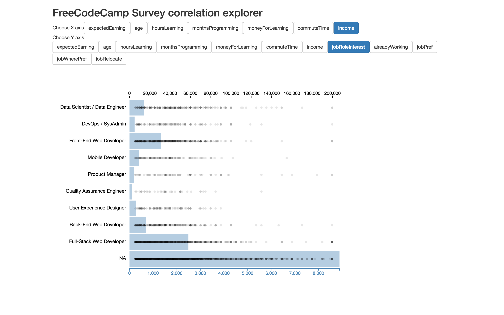

# React and D3 Workshop Project

This is the project for our [React and D3 Workshop](http://www.reactuniversity.com/react-and-d3)

## Requirements:

* [Git](https://git-scm.com/downloads)
* [Node.js](https://nodejs.org/en/)
    * NVM is the easiest way to manage Node. [Its setup instructions here](https://github.com/creationix/nvm#installation). Then run `nvm install node && nvm alias default node`, which installs the latest version of Node.js and sets up your terminal so you can run it by typing `node`. With nvm you can install multiple versions of Node.js and easily switch between them.
    * New to [npm](https://docs.npmjs.com/)?

## Instructions

* Make sure you have satisfied all requirements listed above.
* Clone this repository.
* From the root of this project, run `npm install` to install all the required dependencies.
* To confirm you have installed everything correctly, run `npm start` and navigate to `localhost:3000` in your browser. You should see the completed project.

